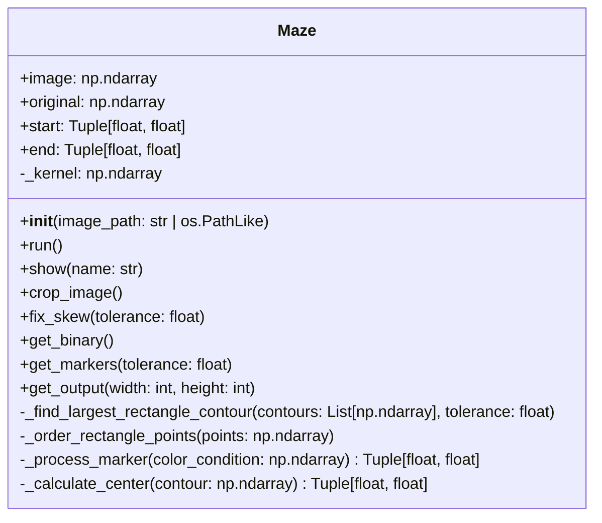

# Maze Solver
Code for a maze solving robot that implements the [A* search algorithm](https://en.wikipedia.org/wiki/A*_search_algorithm) to navigate through any arbitrary maze.

https://github.com/user-attachments/assets/b1059e25-cb8a-4c52-96f4-ead0c01633b7

## Table of Contents
- [Installation](#installation)
- [Usage](#usage)
- [Features](#features)
- [Image Processing](#image-processing)
- [Contributing](#contributing)
- [License](#license)
- [Acknowledgements](#acknowledgements)

## Installation
1. Clone the repository:
```bash
git clone https://github.com/Julien-Mo/Maze-Solver.git
```

2. Install dependencies:
```bash
pip install opencv-python numpy
```

3. Connect the hardware:
- Plug in the overhead webcam to the USB port.
- Plug in the MSP430 to the USB port.
- Connect the gantry to the MSP430.

## Usage
To run the project, use the following steps:
1. Open the `Maze Solver` solution in Visual Studio.
2. Run the `Maze Solver` project.
4. Click `Connect` to connect to the MSP430 microcontroller.
5. Click `Capture` to take an image of the maze from the webcam.
6. Click `Process` to run `image_processing.py`, which will return the processed maze image.
7. Click `Solve` to run the search algorithm, which will find the shortest path from the start to the finish.
8. Click `Move` to send the motor movement packets to the MSP430 microcontroller.
9. Click `Reset` to home the stepper motors and try a new maze.

## Features
1. Captures an image of the maze using the webcam.
2. Converts the image into 2D array of valid positions using OpenCV in Python.
3. Determines the optimal path in C# using A* search algorithm.
4. Sends motor control packets to the MSP430 microprocessor.
5. Moves the maze marker from start to finish by powering an electromagnet and sending stepper commands.

## Image Processing
To convert the image to a bitmap, `image_processing.py` goes through the following steps:

1. `Maze(image_path)`: Reads the image taken from the webcam to OpenCV.


2. `crop_image()`: Manually crops in the image to make further processing easier.


3. `fix_skew()`: Corrects the skew in the image by finding the largest rectangular contour and applying a perspective transform.


4. `get_binary()`: Converts the image to binary by converting to grayscale, applying a `GaussianBlur`, and then using an `adaptiveThreshold`.


5. `get_markers()`: Finds the start and end markers in the maze by removing the contour with the highest concentration of a single color.


6. `get_output()`: Resizes the processed maze and saves its data as a JSON file for the C# program to access.


### UML Class Diagram



## Contributing
1. Fork the repository.
2. Create a new branch: `git checkout -b feature-name`.
3. Make your changes.
4. Push your branch: `git push origin feature-name`.
5. Create a pull request.

## License
This project is licensed under the [MIT License](LICENSE).

## Acknowledgements
Thank you to the UBC MECH 423 instructional team (Dr. Hongshen Ma, Shelby Quiring, and Erik Lamoureux) for their support in making this project possible! 
